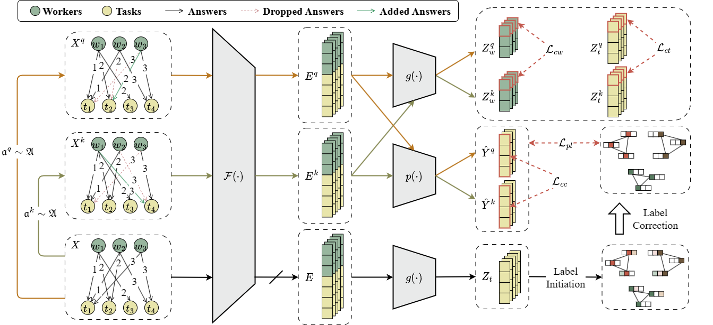

# GOVERN

This repository contains the source code and supplementary materials related to our submission to ICDE 2024, titled "Graph Contrastive Learning for Truth Inference." This work is currently under review.



## Installation

```bash
# Clone the repository
git clone https://github.com/monnochrome012/ICDE24.git

# Go to the project directory
cd ICDE2024

# Create and activate the conda environment
conda env create -f environment.yml
conda activate govern
```
